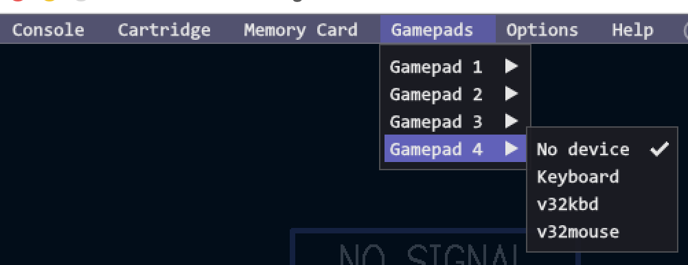
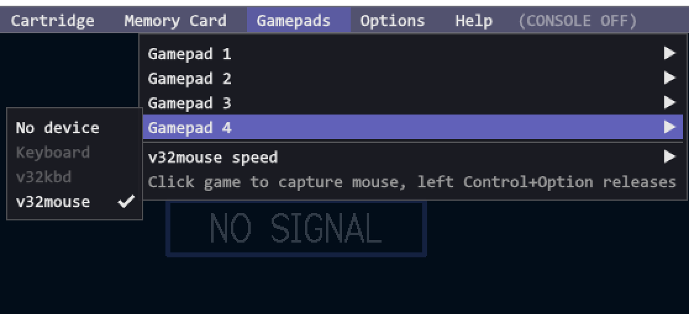
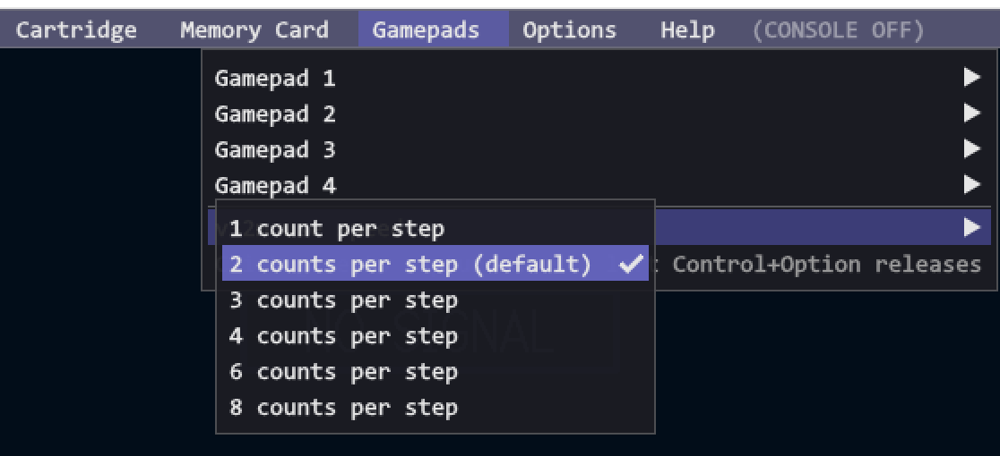

# patch the stock Vircon32 DesktopEmulator to provide emulated v32io peripherals

In  this directory  you will  find the  up-to-date patches  which can  be
applied  against  the  stock  Vircon32 DesktopEmulator  in  the  Vircon32
ComputerSoftware repository on github.

## apply the patches

To  apply  them,  you  will  first want  to  clone  the  ComputerSoftware
repository  to  your  computer  (or  download  one  of  the  source  code
releases).

Once in the  `ComputerSoftware/` directory, you can apply  the patches as
follows (in this order):

```
$ patch -p0 < v32kbd.patch
$ patch -p0 < v32mouse.patch
```

It is important that the `v32kbd.patch` is applied first, followed by the
`v32mouse.patch`.

## usage

Once  applied, build  the DesktopEmulator  according to  the usual  build
instructions for your platform.

After you've build and installed the DesktopEmulator, running it will now show `v32kbd` and `v32mouse` as available devices under the emulator's Gamepads menu:



NOTE  that  `v32kbd` and  the  default  `keyboard` devices  are  mutually
exclusive. Only  ONE can  be enabled  on any  gameport during  a session,
since they BOTH use the local system keyboard.

Additionally,  when  you  make  use  of  `v32mouse`,  under  the  gamepad
submenu  for that  port you've  connected  it, there  will be  additional
options/information available:



Under `v32mouse speed`  you can adjust the tracking speed  (in pixels) of
the emulated `v32mouse` device:


